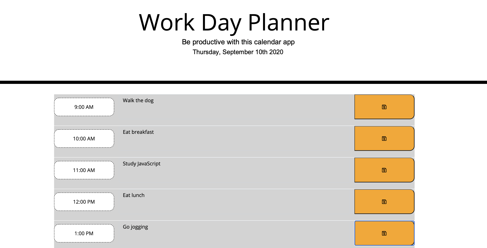

# Work Day Planner

## Project Description

My assignment was to create a daily planner/schedule.  This included rows divided by each hour where the user can enter specific events/tasks.  In order to save each typed entry, the user must select the disk icon.  To clear the entry, the user must first delete the entered text and click the save icon again.

### My Process/Steps

My first step was to set up the rows for each hour in the index html page.  I utilized Bootstrap's grid system.

Next, I worked on the JavaScript to make sure the planner functions properly.  I started by listing my variables.  Next, I entered code to display the current date utilizing Moment.js as a reference.  Afterwards, I worked on the saving function of user entered text.  I then enabled each timeblock to be color coded in order to show which hour is past, present, and future.

Lastly, I connected styling to specific elements in the html.  I also made additional styling edits.

## Website Link
https://edonohue8.github.io/work-day-planner/

## Screenshot of Website Page

* **index**

## Author

* **Eric Donohue**
